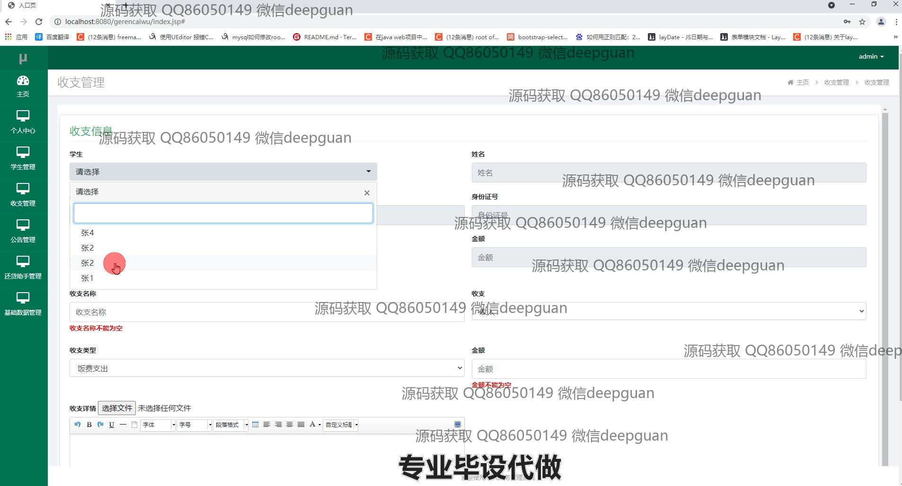

<h1 align="center">基于java web个人财务管理系统</h1>

## 简介
个人财务管理系统：角色分为管理员、用户；功能包括学生管理、收支管理、公告管理、还款助手、统计分析和个人信息管理。    --计算机毕业设计源码；毕设源码；java毕业设计源码

## 联系方式

<h3 align="center">获取完整代码与数据库文件 + 微信：deepguan QQ: 86050149 QQ群: 783742310</h3>

<h3 align="center">可帮忙远程部署 包运行成功！提供远程部署、修改代码、设计文档指导、代码讲解等服务！</h3>

## 功能介绍（完整见运行截图）
管理员：支持登录、注册和退出，访问主页并管理全系统功能模块。可管理学生信息、公告类型、还款助手和收支信息，具备新增、修改、删除及查询的权限；可查看财务数据统计，并通过可视化图表展示收支比例，管理个人信息和系统公告。

用户：支持登录、注册和退出，查看个人中心管理自己的账户信息，包括姓名、身份证号、手机号和财务记录等；可通过学生管理模块查看或修改个人财务数据；能输入和查询收支信息，进行详细描述和文件上传；通过图表了解个人财务状态，提供月度收支分析与展示。

## 运行截图

本代码来源于网络,仅供学习参考使用!

